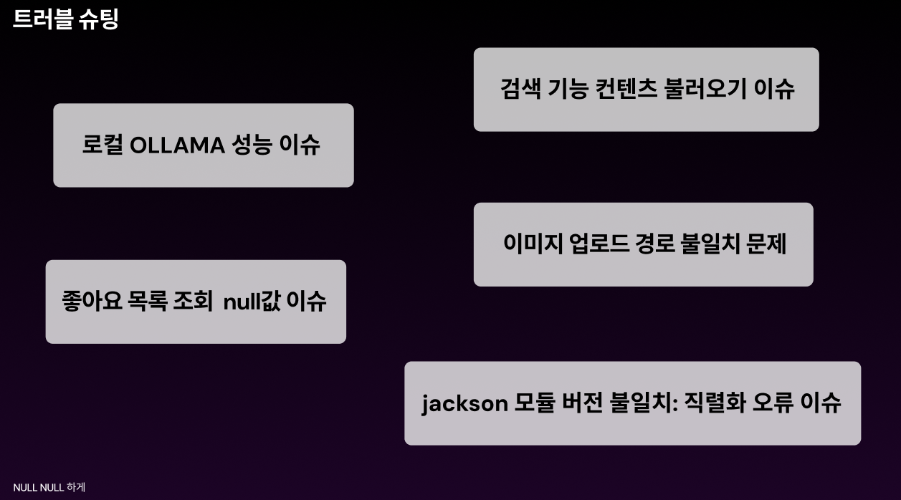

# NBE5-6-3-Team05

  

---

## 📌 3차 프로젝트 목표

- 2차 프로젝트 버전업 ([2차 프로젝트 보러가기](https://github.com/prgrms-be-devcourse/NBE5-6-2-Team05)) 
    - 기능 개선, 기능 추가, 성능개선, 코틀린 마이그레이션

---

##  ✨ 버전업 사항
아래는 2차 프로젝트 대비 3차 프로젝트에서 개선된 주요 기능입니다.

| 기능명          | 설명                                                     |
|--------------|--------------------------------------------------------|
| JWT 로그인      | 기존 세션 로그인에서 JWT 기반 인증 방식으로 개선                          |
 키워드 검색 개선    | 가수, 작가, 출판사명 등 다양한 조건으로 검색 가능                          |
| 장르별 조회	      | 장르를 선택하여 필터링 기능 제공                                     |
| 영화 예고편 재생    | 상세페이지에서 트레일러 영상 재생 지원                                  |
| 음악 트레일러 재생   | 음악 상세페이지에서 뮤직비디오 재생 가능                                 |
| 메일 인증 회원가입   | Kotlin + Outbox + Redis Pub/Sub 사용한 인증 구현              |
| 관리자 페이지 개선   | 장르 관리 기능 추가, API 기반 콘텐츠 등록 개선                          |
| 모달창 통합       | 다양한 팝업 UI 통합 설계로 UX 개선                                 |
| 메인 페이지 개선    | 상위 콘텐츠 출력 , 추천 기록 출력, 헤더 변경, Moody 캐릭터 제작              |
| LLM 기반 추천 개선 | 키워드별 추천 결과 캐싱(DB 저장)으로 안정적 추천 제공                       |
| 월드컵 기능 추가    | 사용자가 영화, 음악, 도서 중 하나를 선택해 토너먼트 방식으로 자신의 최애를 골라가는 기능 제공 |

---

##  👉 버전업 사항 보기
- 화면에서 버전업 사항을 확인할 수 있는 기능은 GIF 제작했습니다.

<table>
  <tr>
    <td align="center"><b>메인 페이지 개선</b></td>
    <td align="center"><b>트레일러 재생 기능 추가</b></td>
  </tr>
  <tr>
    <td align="center">
      
    </td>
    <td align="center">
      
    </td>
  </tr>

<tr>
    <td align="center"><b>월드컵 기능 추가</b></td>
    <td align="center"><b>관리자 페이지 개선</b></td>
  </tr>
  <tr>
    <td align="center">
      
    </td>
    <td align="center">
      
    </td>
  </tr>

  <tr>
    <td align="center"><b>키워드 검색 개선</b></td>
    <td align="center"><b>장르별 조회 추가</b></td>
  </tr>
  <tr>
    <td align="center">
      
    </td>
    <td align="center">
      
    </td>
  </tr>

</table>

## 🧑‍💻 팀원 소개

<table>
  <tbody>
    <tr>
      <td align="center"><b>이강현</b></td>
      <td align="center"><b>강민서</b></td>
      <td align="center"><b>강대겸</b></td>
      <td align="center"><b>최종우</b></td>
      <td align="center"><b>안준희</b></td>
    </tr>
    <tr>
      <td align="center"></td>
      <td align="center"></td>
      <td align="center"></td>
      <td align="center"></td>
      <td align="center"></td>
    </tr>
    <tr>
      <td align="center"><b>PM</b></td>
      <td align="center"><b>TM</b></td>
      <td align="center"><b>TM</b></td>
      <td align="center"><b>TM</b></td>
      <td align="center"><b>TM</b></td>
    </tr>
    <tr>
      <td align="center"><a href="https://github.com/Leeka99"><b>GitHub</b></a></td>
      <td align="center"><a href="https://github.com/childstone"><b>GitHub</b></a></td>
      <td align="center"><a href="https://github.com/KangDaegyeom"><b>GitHub</b></a></td>
      <td align="center"><a href="https://github.com/lnvisibledragon"><b>GitHub</b></a></td>
      <td align="center"><a href="https://github.com/june3780"><b>GitHub</b></a></td>
    </tr>
  </tbody>
</table>

## 🛠️ 트러블 슈팅

 

## 🧾 코드 컨벤션

커밋 메시지는 다음 규칙에 맞춰 작성합니다

> 📌 예시: **`(feat) sign up complete`**

---

| 태그                | 설명                                      |
|-------------------|-----------------------------------------|
| ✨ **feat**        | 새로운 기능 추가                               |
| 🐛 **fix**        | 버그 수정                                   |
| 📝 **docs**       | 문서 수정 (README 등)                        |
| 💄 **style**      | 코드 포맷팅, 세미콜론 누락, 코드 변경 없음               |
| ♻️ **refactor**   | 코드 리팩토링 (기능 변화 없이 구조 개선)                |
| ✅ **test**        | 테스트 코드 추가, 기존 테스트 리팩토링                  |
| 🔧 **chore**      | 빌드 설정 변경, 패키지 매니저 설정 등                  |
| 🔀 **merge**      | 브랜치 병합 (예: `(merge) main` → main과 병합했음) |
| 📍 **checkpoint** | 진행중(체크포인트)                              |
| 🎨 **design**     | 뷰 디자인 변경                                |

---
[NULL NULL 하게 3차 발표자료 보기](readmeresource/nullnullppt.pdf) 
[NULL NULL 하게 팀 3차 프로젝트 WBS](readmeresource/wbs_timeline.png) 