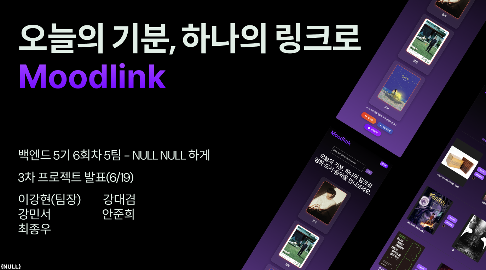

# NBE5-6-2-Team05

  

[NULL NULL 하게 팀 2차 프로젝트 일정 관리 (Trello 보드 바로가기)](https://trello.com/invite/b/6811b337d5d7ce2d450d478c/ATTIeca7861455dcaf3f28360d213a4a04c45ADC8408/nbe5-6-2-null-null-하게) 

---

## 📌 프로젝트 소개

    
    
  

 

##  ✨ 기능
<table>
  <tr>
    <td align="center"><b>LLM 추천 키워드</b></td>
    <td align="center"><b>추천 결과</b></td>
  </tr>
  <tr>
    <td align="center">
      
    </td>
    <td align="center">
      
    </td>
  </tr>

  <tr>
    <td align="center"><b>오늘의 운세</b></td>
    <td align="center"><b>통합 검색(전체)</b></td>
  </tr>
  <tr>
    <td align="center">
      
    </td>
    <td align="center">
      
    </td>
  </tr>

  <tr>
    <td align="center"><b>통합 검색(키워드)</b></td>
    <td align="center"><b>마이페이지</b></td>
  </tr>
  <tr>
    <td align="center">
      
    </td>
    <td align="center">
      
    </td>
  </tr>

  <tr>
    <td align="center"><b>관리자 페이지 – 추가</b></td>
    <td align="center"><b>관리자 페이지 – 조회·수정</b></td>
  </tr>
  <tr>
    <td align="center">
      
    </td>
    <td align="center">
      
    </td>
  </tr>
</table>

## 🧑‍💻 팀원 소개

<table>
  <tbody>
    <tr>
      <td align="center"><b>이강현</b></td>
      <td align="center"><b>강민서</b></td>
      <td align="center"><b>강대겸</b></td>
      <td align="center"><b>최종우</b></td>
      <td align="center"><b>안준희</b></td>
    </tr>
    <tr>
      <td align="center"></td>
      <td align="center"></td>
      <td align="center"></td>
      <td align="center"></td>
      <td align="center"></td>
    </tr>
    <tr>
      <td align="center"><b>PM</b></td>
      <td align="center"><b>TM</b></td>
      <td align="center"><b>TM</b></td>
      <td align="center"><b>TM</b></td>
      <td align="center"><b>TM</b></td>
    </tr>
    <tr>
      <td align="center"><a href="https://github.com/Leeka99"><b>GitHub</b></a></td>
      <td align="center"><a href="https://github.com/childstone"><b>GitHub</b></a></td>
      <td align="center"><a href="https://github.com/KangDaegyeom"><b>GitHub</b></a></td>
      <td align="center"><a href="https://github.com/lnvisibledragon"><b>GitHub</b></a></td>
      <td align="center"><a href="https://github.com/june3780"><b>GitHub</b></a></td>
    </tr>
  </tbody>
</table>

## 👨‍🔧 기술 스택 & 협업 도구

 

## 📍 System Architeture

 

## 📊 ERD

 

 

## ✏️ UI Flow

 

## 🛠️ 트러블 슈팅

 

## 🧾 코드 컨벤션

커밋 메시지는 다음 규칙에 맞춰 작성합니다

> 📌 예시: **`(feat) sign up complete`**

---

| 태그                | 설명                                      |
|-------------------|-----------------------------------------|
| ✨ **feat**        | 새로운 기능 추가                               |
| 🐛 **fix**        | 버그 수정                                   |
| 📝 **docs**       | 문서 수정 (README 등)                        |
| 💄 **style**      | 코드 포맷팅, 세미콜론 누락, 코드 변경 없음               |
| ♻️ **refactor**   | 코드 리팩토링 (기능 변화 없이 구조 개선)                |
| ✅ **test**        | 테스트 코드 추가, 기존 테스트 리팩토링                  |
| 🔧 **chore**      | 빌드 설정 변경, 패키지 매니저 설정 등                  |
| 🔀 **merge**      | 브랜치 병합 (예: `(merge) main` → main과 병합했음) |
| 📍 **checkpoint** | 진행중(체크포인트)                              |

---

[NULL NULL 하게 발표자료 보기](readmeresource/nullnullppt.pdf) 
[NULL NULL 하게 팀 2차 프로젝트 WBS(Gantt)](readmeresource/wbs_timeline.pdf) 

