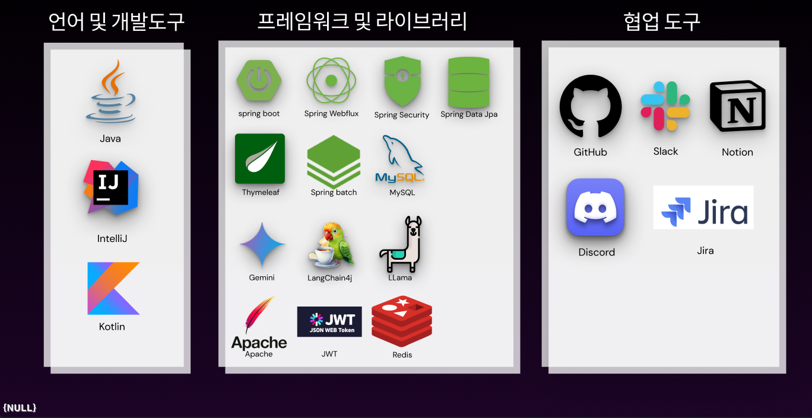

# NBE5-6-2-Team05

  

[NULL NULL 하게 팀 2차 프로젝트 일정 관리 (Trello 보드 바로가기)](https://trello.com/invite/b/6811b337d5d7ce2d450d478c/ATTIeca7861455dcaf3f28360d213a4a04c45ADC8408/nbe5-6-2-null-null-하게) 

---

## 📌 프로젝트 소개

  
  

 

## 🧑‍💻 팀원 소개

  <table >
    <tbody>
      <tr>
        <td align="center"><b>이강현</b></td>
        <td align="center"><b>강민서</b></td>
        <td align="center"><b>강대겸</b></td>
        <td align="center"><b>최종우</b></td>
        <td align="center"><b>안준희</b></td>
      </tr>
      <tr>
        <td align="center"></td>
        <td align="center"></td>
        <td align="center"></td>
        <td align="center"></td>
        <td align="center"></td>
      </tr>
<tr>
        <td align="center"><b>PM</b></td>
        <td align="center"><b>TM</b></td>
        <td align="center"><b>TM</b></td>
        <td align="center"><b>TM</b></td>
        <td align="center"><b>TM</b></td>
      </tr>
      <tr>
        <td align="center"><a href="https://github.com/Leeka99"><b>GitHub</b></a></td>
        <td align="center"><a href="https://github.com/childstone"><b>GitHub</b></a></td>
        <td align="center"><a href="https://github.com/KangDaegyeom"><b>GitHub</b></a></td>
        <td align="center"><a href="https://github.com/lnvisibledragon"><b>GitHub</b></a></td>
        <td align="center"><a href="https://github.com/june3780"><b>GitHub</b></a></td>
      </tr>
    </tbody>
  </table>

 

## 🛠️ 기술 스택

 

## 📍 System Architeture

 

## 📊 ERD

 

 

## ✏️ UI Flow

 

## 🖥️ 주요 화면 (UI)

 

## 📅 Gantt

## 🛠️ 트러블 슈팅 & 해결 과정

# 코드 컨벤션
- ex ) (feat) sign up complete  

- feat : 새로운 기능 추가 
- fix : 버그 수정 
- docs : 문서 수정 
- style : 코드 포맷팅, 세미콜론 누락, 코드 변경이 없는 경우 
- refactor : 코드 리펙토링 
- test : 테스트 코드, 리펙토링 테스트 코드 추가 
- chore : 빌드 업무 수정, 패키지 매니저 수정 
- merge : 병합 알림 -> ex ) (merge) main   뜻 : main과 병합했음

---

[NULL NULL 하게 발표자료 보기](readmeresource/ppt.pdf) 
[NULL NULL 하게 팀 2차 프로젝트 WBS_Apr](readmeresource/wbs_timeline_Apr.pdf) 
[NULL NULL 하게 팀 2차 프로젝트 WBS_May](readmeresource/wbs_timeline_may.pdf) 

